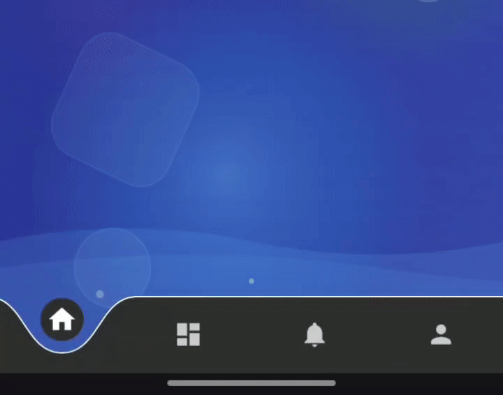

# Curved Bottom Navigation

[](https://jitpack.io/#Hamza-Bula/curved-bottom-navigation)
[](https://android-arsenal.com/api?level=24)
[](LICENSE)

A modern Android bottom navigation bar with a unique curved bubble design and smooth animations.



Features

Curved bubble design with elevation effect
Smooth animations with customizable interpolators
Highly customizable colors, sizes, and animations
Simple API with XML and programmatic configuration
Lightweight with minimal dependencies
Supports 2-5 navigation items with automatic validation

Requirements

Minimum SDK: 24 (Android 7.0)

## Download

### Step 1: Add JitPack repository

Add JitPack repository to your root `settings.gradle.kts`:

```kotlin
dependencyResolutionManagement {
    repositories {
        google()
        mavenCentral()
        maven { url = uri("https://jitpack.io") }
    }
}
```

### Step 2: Add the dependency

Add the dependency in your app module's `build.gradle.kts`:

```kotlin
dependencies {
    implementation("com.github.Hamza-Bula:curved-bottom-navigation:1.0.0")
}
```

## Usage

### 1. Create menu resource file

Create a menu file at `res/menu/bottom_nav_menu.xml`:

```xml
<?xml version="1.0" encoding="utf-8"?>
<menu xmlns:android="http://schemas.android.com/apk/res/android">
    <item
        android:id="@+id/navigation_home"
        android:icon="@drawable/baseline_home_24"
        android:title="Home" />
    <item
        android:id="@+id/navigation_dashboard"
        android:icon="@drawable/baseline_dashboard_24"
        android:title="Dashboard" />
    <item
        android:id="@+id/navigation_notifications"
        android:icon="@drawable/baseline_notifications_24"
        android:title="Notifications" />
    <item
        android:id="@+id/navigation_profile"
        android:icon="@drawable/baseline_person_24"
        android:title="Profile" />
</menu>
```

### 2. Add to your layout

Add the CustomBottomNavigationView to your layout XML:

```xml
<com.hamza.curvedbottomnavigation.CustomBottomNavigationView
    android:id="@+id/custom_bottom_navigation"
    android:layout_width="match_parent"
    android:layout_height="55dp"
    app:layout_constraintBottom_toBottomOf="parent" />
```

### 3. Setup in MainActivity

```kotlin
class MainActivity : AppCompatActivity() {
    override fun onCreate(savedInstanceState: Bundle?) {
        super.onCreate(savedInstanceState)
        setContentView(R.layout.activity_main)

        val bottomNavigation = findViewById<CustomBottomNavigationView>(R.id.custom_bottom_navigation)

        bottomNavigation.setNavigationItems(listOf(
            NavItem(R.id.navigation_home, R.drawable.baseline_home_24, "Home"),
            NavItem(R.id.navigation_dashboard, R.drawable.baseline_dashboard_24, "Dashboard"),
            NavItem(R.id.navigation_notifications, R.drawable.baseline_notifications_24, "Notifications"),
            NavItem(R.id.navigation_profile, R.drawable.baseline_person_24, "Profile")
        ))

        bottomNavigation.setOnItemSelectedListener(object : CustomBottomNavigationView.OnItemSelectedListener {
            override fun onItemSelected(itemId: Int) {
                when (itemId) {
                    R.id.navigation_home -> loadFragment(HomeFragment())
                    R.id.navigation_dashboard -> loadFragment(DashboardFragment())
                    R.id.navigation_notifications -> loadFragment(NotificationsFragment())
                    R.id.navigation_profile -> loadFragment(ProfileFragment())
                }
            }
        })

        if (savedInstanceState == null) {
            loadFragment(HomeFragment())
            bottomNavigation.setSelectedItem(R.id.navigation_home)
        }
    }

    private fun loadFragment(fragment: Fragment) {
        supportFragmentManager.beginTransaction()
            .replace(R.id.fragment_container, fragment)
            .commit()
    }
}
```

## Customization

### XML Attributes

Customize the appearance directly in your layout XML:

```xml
<com.hamza.curvedbottomnavigation.CustomBottomNavigationView
    android:id="@+id/custom_bottom_navigation"
    android:layout_width="match_parent"
    android:layout_height="55dp"
    
    app:navBackgroundColor="#2E2E2E"
    app:selectedIconBackgroundColor="#FF5722"
    app:selectedIconColor="#FFFFFF"
    app:unselectedIconColor="#AAAAAA"
    app:borderColor="#FFFFFF"
    
    app:bubbleRadius="200dp"
    app:selectedIconSize="68dp"
    app:unselectedIconSize="64dp"
    
    app:bubbleAnimationDuration="500"
    app:iconAnimationDuration="1000" />
```

### Programmatic Customization

You can also customize properties programmatically:

```kotlin
bottomNavigation.apply {
    navBackgroundColor = Color.parseColor("#2E2E2E")
    selectedIconBackgroundColor = Color.parseColor("#FF5722")
    selectedIconColor = Color.WHITE
    unselectedIconColor = Color.LTGRAY
    borderColor = Color.WHITE
    
    bubbleRadius = 200f
    selectedIconSize = 68
    unselectedIconSize = 64
    
    bubbleAnimationDuration = 500L
    iconAnimationDuration = 1000L
}
```

## Available Attributes

### Colors

| Attribute | Type | Default | Description |
|-----------|------|---------|-------------|
| `navBackgroundColor` | color | `#2E2E2E` | Navigation bar background color |
| `selectedIconBackgroundColor` | color | `#2E2E2E` | Selected icon background circle color |
| `selectedIconColor` | color | `#FFFFFF` | Selected icon tint color |
| `unselectedIconColor` | color | `#CCCCCC` | Unselected icon tint color |
| `borderColor` | color | `#FFFFFF` | Top border line color |

### Dimensions

| Attribute | Type | Default | Description |
|-----------|------|---------|-------------|
| `navHeight` | dimension | `200dp` | Navigation bar height |
| `bubbleRadius` | dimension | `200dp` | Bubble radius size |
| `selectedIconSize` | dimension | `68dp` | Selected icon size |
| `unselectedIconSize` | dimension | `64dp` | Unselected icon size |
| `selectedIconBackgroundRadius` | dimension | `46dp` | Selected icon background circle radius |
| `borderStrokeWidth` | dimension | `3dp` | Top border stroke width |
| `selectedIconY` | dimension | `50dp` | Selected icon Y position from top |

### Bubble Shape Properties

| Attribute | Type | Default | Description |
|-----------|------|---------|-------------|
| `bubbleWidthMultiplier` | float | `2.0` | Controls bubble width relative to radius |
| `bubbleHeightFactor` | float | `0.6` | Controls bubble curve depth |
| `bubbleCurveFactor` | float | `0.2` | Controls curve smoothness |
| `bubbleEdgeFactor` | float | `0.4` | Controls bubble edge width |

### Animation Properties

| Attribute | Type | Default | Description |
|-----------|------|---------|-------------|
| `bubbleAnimationDuration` | integer | `500` | Bubble movement animation duration (ms) |
| `iconAnimationDuration` | integer | `1000` | Icon animation duration (ms) |
| `iconScaleMin` | float | `0.3` | Minimum icon scale during animation |
| `iconScaleMax` | float | `1.0` | Maximum icon scale after animation |
| `iconScaleOvershoot` | float | `1.5` | Icon scale overshoot amount |
| `iconPositionOvershoot` | float | `1.2` | Icon position overshoot amount |

See [attrs.xml](curvedbottomnavigation/src/main/res/values/attrs.xml) for the complete list of available attributes.

## Important Notes

The library supports **2 to 5 navigation items**:

- **Less than 2 items**: Warning shown, but will work
- **More than 5 items**: Only first 5 items used, warning shown

## Sample App

Check out the [sample app](app/) for complete examples and implementation details.

## Troubleshooting

### Icons not showing

Make sure your drawable resources exist in `res/drawable/`:

```
res/
  drawable/
    baseline_home_24.xml
    baseline_dashboard_24.xml
    baseline_notifications_24.xml
    baseline_person_24.xml
```

## License

```
Copyright 2024-2025 Hamza Bula

Licensed under the Apache License, Version 2.0 (the "License");
you may not use this file except in compliance with the License.
You may obtain a copy of the License at

    http://www.apache.org/licenses/LICENSE-2.0

Unless required by applicable law or agreed to in writing, software
distributed under the License is distributed on an "AS IS" BASIS,
WITHOUT WARRANTIES OR CONDITIONS OF ANY KIND, either express or implied.
See the License for the specific language governing permissions and
limitations under the License.
```

## Contributing

Contributions are welcome! Please feel free to submit a Pull Request.

1. Fork the repository
2. Create your feature branch (`git checkout -b feature/AmazingFeature`)
3. Commit your changes (`git commit -m 'Add some AmazingFeature'`)
4. Push to the branch (`git push origin feature/AmazingFeature`)
5. Open a Pull Request

## Author

**Hamza Bula** - [@Hamza-Bula](https://github.com/Hamza-Bula)

## Support

If you find this library useful, please consider giving it a ⭐ on GitHub!

For issues, questions, or suggestions, please [open an issue](https://github.com/Hamza-Bula/curved-bottom-navigation/issues).
